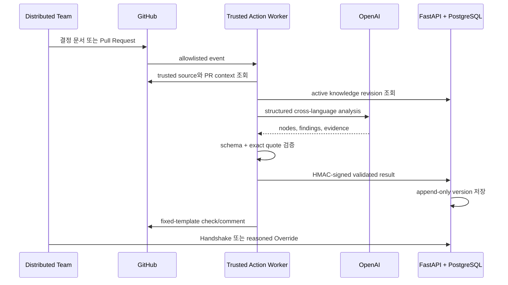
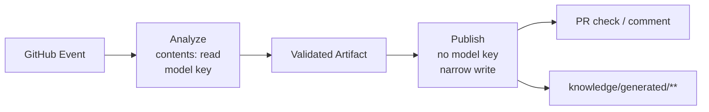

# Alignment Memory — Backend

> **GitHub의 의사결정을 기억해 새 PR의 적합성을 검증하는 AI 협업 시스템**

서로 다른 언어와 시간대에서 내려진 결정은 쉽게 번역되지만, 결정의 이유와 근거는 다음 작업으로 잘 이어지지 않습니다. Alignment Memory Backend는 GitHub 원문을 버전형 지식으로 보존하고, OpenAI가 새 Pull Request와 기존 결정을 의미 단위로 비교한 뒤, **검증 가능한 근거가 있을 때만** 결과를 저장·게시합니다.

[Frontend](https://alignment-memory-fe.vercel.app) · [실제 Direct Conflict](https://github.com/gyutaetae/alignment-memory-be/pull/16#issuecomment-5360243431) · [Live API](https://alignment-memory-be-production.up.railway.app/healthz) · [공식 제출 페이지](https://likelion.community/competitions/central-hackathon/animal-league-3rd/projects/57f739ab-f0e8-4a92-ac71-8984ac5184dd?ref=projectss)

## 60초 Live proof

| 검증 단계 | 실제 공개 증거 | 의미 |
| --- | --- | --- |
| 기준 메모리 생성 | [Baseline Analyze](https://github.com/gyutaetae/alignment-memory-be/actions/runs/32412946088) · [Baseline Publish](https://github.com/gyutaetae/alignment-memory-be/actions/runs/32413254788) | 기존 결정을 AI로 구조화하고 게시 |
| 새 PR 분석 | [Analyze 성공](https://github.com/gyutaetae/alignment-memory-be/actions/runs/32413322000) | 한국어 결정과 영어 변경을 OpenAI로 비교 |
| 근거 게시 | [Publish 성공](https://github.com/gyutaetae/alignment-memory-be/actions/runs/32413387501) | 검증된 고정 형식 결과를 GitHub에 게시 |
| 사용자 결과 | [PR #16 Direct Conflict 댓글](https://github.com/gyutaetae/alignment-memory-be/pull/16#issuecomment-5360243431) | 정확한 기존 결정 인용과 다음 행동 제공 |
| 배포 상태 | [Railway `/healthz`](https://alignment-memory-be-production.up.railway.app/healthz) | `status=ok`, `mode=live` API |

PR #16의 Alignment check가 실패한 것은 장애가 아닙니다. **검증된 기존 결정과 충돌하는 변경의 병합을 차단한 성공 결과**입니다.

## Capture → Align → Continue



### 세 가지 판정

- `Aligned`: 기존 목표·결정과 충돌하지 않습니다.
- `Missing Alignment`: 작업 의도나 참고 근거가 더 필요합니다.
- `Direct Conflict`: 검증된 기존 결정과 의미상 직접 충돌합니다.

## AI, 코드, 사람의 책임을 분리합니다

| AI가 수행 | 일반 코드가 보장 | 사람이 결정 |
| --- | --- | --- |
| 한국어 결정과 영어 PR의 의미 비교 | 인용문이 저장된 원문에 정확히 존재하는지 | 동의·질문·반대 |
| 목표·결정·제약·책임 구조화 | Pydantic 스키마와 허용 타입 | AI 오판 교정 |
| 역할별 Context Passport 생성 | 인증·권한·멱등성·고정 게시 경로 | 기존 결정 대체와 사유 기록 |

모델 출력에는 `sourceVersionId`와 정확한 인용문이 필요합니다. 저장된 원문·대상 노드·스키마 중 하나라도 일치하지 않으면 결과를 게시하지 않습니다. 따라서 AI는 핵심 의미 분석을 담당하지만 최종 권한을 갖지 않습니다.

## 보더리스 협업에서 Backend가 하는 일

| 경계 | 실제 팀의 상황 | 시스템의 해결 방식 |
| --- | --- | --- |
| 지리 | 토론토·다낭·서울·도쿄의 비동기 인계 | 어느 시간대에서도 조회 가능한 revision 기반 Project Memory |
| 언어 | 한국어·영어·일본어·베트남어 사용 | 원문을 보존한 교차언어 의미 분석 |
| 문화 | 업무 시간·직무별 소통 방식 차이 | 국적을 추정하지 않고 자기 선언 역할·언어로 Passport 생성 |
| 조직 | PM·Frontend·Backend 책임 경계 | Source·PR·책임·Handshake를 하나의 근거 사슬로 연결 |

서로 다른 회사가 사용했다고 주장하지 않습니다. 실제 조직 경계는 한 해커톤 팀 안의 직무와 책임 경계입니다. 네 역할을 동시에 전환하는 화면은 실제 팀 구성을 바탕으로 한 데모 재연이며, 위 GitHub 실행 링크와 구분합니다.

## 최소 권한 GitHub Actions



- Analyze는 PR head의 코드를 실행하지 않고 trusted base의 Worker를 사용합니다.
- Publish에는 모델 키를 전달하지 않습니다.
- 모델은 게시 경로나 자유 형식 댓글을 선택할 수 없습니다.
- PR뿐 아니라 `main` push도 다시 분석해 기준 SHA가 뒤처지지 않도록 합니다.
- 데이터베이스 저장과 게시가 완료된 뒤에만 checkpoint를 전진시키며, 재실행은 중복 결과를 만들지 않습니다.

## 로컬 실행

요구 환경: Python `3.12–3.13`, [uv](https://docs.astral.sh/uv/)

### 계정 없는 결정론적 Fixture

```bash
make setup
make demo-evidence
```

`artifacts/demo/`에 평가 결과, vertical slice, conflict/resolved 댓글, Project Memory가 생성됩니다. 각 결과에는 `externalServicesCalled=false`, `liveProof=false`가 명시됩니다.

```bash
APP_MODE=fixture uv run uvicorn \
  alignment_memory.interfaces.api.main:create_app \
  --factory --host 127.0.0.1 --port 8000 --reload
```

### Live mode

```bash
cp .env.example .env
APP_MODE=live uv run uvicorn \
  alignment_memory.interfaces.api.main:create_app \
  --factory --host 0.0.0.0 --port 8000
```

Live mode에는 PostgreSQL/Supabase, Supabase Auth, GitHub App, 내부 HMAC secret, OpenAI 또는 OpenRouter 설정이 필요합니다. 시작 시 필수 설정과 CORS origin을 검증하며 비밀값은 커밋하지 않습니다.

> 이전 대화에 노출된 API 키는 공개된 비밀값으로 간주하고 폐기·재발급해야 합니다. README와 로그에는 키를 기록하지 않습니다.

## 검증

```bash
make check
```

현재 변경 기준으로 Ruff와 pytest를 포함한 `make check`가 통과합니다. PostgreSQL migration/RLS 테스트는 `TEST_DATABASE_URL`이 있을 때 별도로 실행됩니다.

## API와 코드 구조

- 사용자 API: Supabase Bearer JWT + repository membership
- Worker API: timestamped HMAC signature + replay window
- Health: `GET /healthz`
- OpenAPI: 실행 중인 서버의 `/docs`

```text
src/alignment_memory/
├── domain/          결정 규칙과 불변 엔티티
├── application/     분석과 knowledge projection use case
├── ports/           GitHub, LLM, repository 경계
├── adapters/        GitHub, OpenAI, OpenRouter, PostgreSQL, fixture
├── contracts/       검증되는 AI 구조화 출력
└── interfaces/
    ├── api/         FastAPI control plane
    └── worker/      GitHub Actions CLI worker

supabase/migrations/ 버전형 지식과 RLS
.github/workflows/   Analyze / Publish 권한 분리
knowledge/generated/ 허용된 AI 생성 경로
tests/               unit, integration, fixture evaluation
```

## 사실 경계

- **Live proof:** 위의 실제 GitHub Actions·PR·Railway 링크
- **Fixture:** 계정 없이 재현하는 로컬 제품 흐름이며 외부 호출 증거가 아님
- **데모 재연:** 실제 네 지역·네 언어 팀 구성을 활용한 역할 전환
- **사람의 판단:** Handshake와 Override; AI가 최종 합의를 대신하지 않음

- [제품 요구사항](./docs/prd.md)
- [전체 이벤트 흐름](./docs/flow.md)
- [데이터 스키마](./docs/data-schema.md)
- [Architecture Decisions](./docs/adr.md)
- [Cross-border demo agreement](./docs/demo-cross-border-agreement.md)
