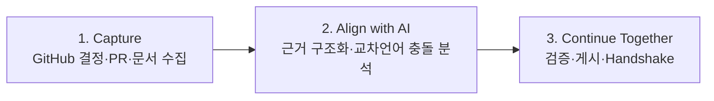
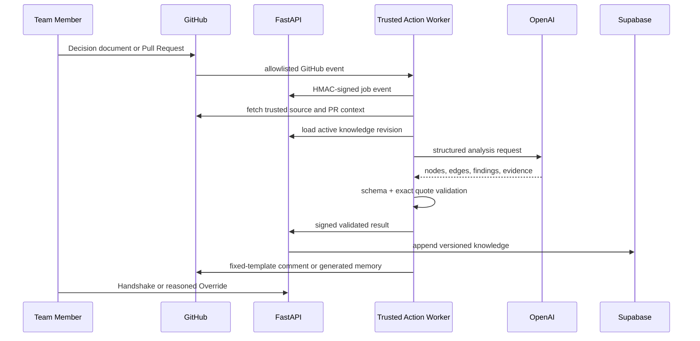
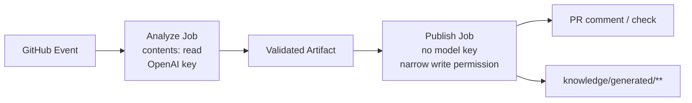

# Alignment Memory — Backend

> **결정은 번역되어도, 맥락은 쉽게 사라집니다.**

Alignment Memory Backend는 GitHub의 결정·문서·Pull Request를 수집하고, AI가 서로 다른 언어의 의미 충돌을 분석하도록 한 뒤, 결과가 실제 원문 근거와 일치할 때만 저장·게시하는 FastAPI 기반 시스템입니다.

[Frontend Demo](https://alignment-memory-fe.vercel.app) · [Frontend Repository](https://github.com/gyutaetae/alignment-memory-fe) · [Live API Health](https://alignment-memory-be-production.up.railway.app/healthz)

## 3단계로 이해하기



1. **Capture:** 신뢰할 수 있는 GitHub 이벤트와 원문을 불변 Source Version으로 저장합니다.
2. **Align with AI:** AI가 결정·제약·책임을 구조화하고 새 변경과 기존 합의의 의미를 비교합니다.
3. **Continue Together:** 코드가 인용과 스키마를 검증한 뒤 결과를 게시하고, 사람이 Handshake 또는 Override를 기록합니다.

## AI가 필요한 이유

한국어 결정이 “외부 서비스에 원문 메시지를 저장하지 않는다”고 말하고 영어 PR이 “remote debugging을 위해 raw prompts를 저장한다”고 제안할 때, 단순 번역이나 키워드 일치만으로는 프로젝트 의도까지 안정적으로 비교하기 어렵습니다.

| AI가 수행 | 일반 코드가 보장 | 사람이 결정 |
| --- | --- | --- |
| 교차언어 의미 비교 | 정확한 원문 인용 검증 | 동의·질문·반대 |
| 결정·제약·책임 구조화 | Pydantic 스키마와 허용 타입 검증 | AI 오판 교정 |
| Context Passport 생성 | 인증·권한·멱등성·고정 게시 경로 | 기존 결정 대체와 사유 기록 |

AI 결과가 그럴듯하다는 이유만으로 저장하지 않습니다. 참조한 `sourceVersionId`, 정확한 인용문, 저장된 원문, 대상 노드 상태가 모두 일치해야 판정이 다음 단계로 진행됩니다.

## Figure 1. End-to-end Flow



## Figure 2. 권한을 분리한 GitHub Actions



- Analyze Job은 PR head 코드를 실행하지 않고 trusted base의 Worker를 사용합니다.
- Publish Job에는 모델 API 키가 전달되지 않습니다.
- 모델 출력은 임의 파일 경로를 선택할 수 없고 고정 템플릿만 게시합니다.
- `main` 변경도 다시 분석해 Project Memory의 기준 SHA가 뒤처지지 않도록 갱신합니다.

## 네 가지 경계와 Backend의 역할

| 경계 | Backend가 제공하는 것 |
| --- | --- |
| 지리 | 시간차와 관계없이 다시 조회할 수 있는 버전형 프로젝트 메모리 |
| 언어 | 서로 다른 언어의 결정과 변경에 대한 의미 분석 및 원문 보존 |
| 문화 | 사용자가 선택한 언어·역할에 맞춘 Passport, 모호성 질문 유지 |
| 조직 | PM·Frontend·Backend의 결정과 구현을 GitHub Source, PR, 책임, Handshake로 연결 |

이번 프로젝트의 실제 조직 경계는 서로 다른 회사가 아니라 **한 해커톤 팀 안의 직무와 책임 경계**입니다.

## 실행하기

요구 환경: Python `3.12–3.13`, [uv](https://docs.astral.sh/uv/)

### 1. 계정 없는 Fixture 증거 생성

```bash
make setup
make demo-evidence
```

결과는 `artifacts/demo/`에 생성됩니다.

- `evaluation.md`: 6개 분석 fixture 평가
- `vertical-slice.json`: API → Worker → 수정 → 재분석 전체 흐름
- `conflict-comment.md`, `resolved-comment.md`: 고정 게시 템플릿
- `project-memory.md`: 생성된 Project Memory

Fixture 결과에는 `externalServicesCalled=false`, `liveProof=false`가 명시됩니다. 로컬 동작 증거이지 GitHub·OpenAI·Supabase의 라이브 성공 증거는 아닙니다.

### 2. Fixture API 실행

```bash
APP_MODE=fixture uv run uvicorn \
  alignment_memory.interfaces.api.main:create_app \
  --factory --host 127.0.0.1 --port 8000 --reload
```

```bash
curl -fsS http://127.0.0.1:8000/healthz
```

예상 응답:

```json
{"status":"ok","service":"alignment-memory","mode":"fixture"}
```

### 3. Live mode

```bash
cp .env.example .env
APP_MODE=live uv run uvicorn \
  alignment_memory.interfaces.api.main:create_app \
  --factory --host 0.0.0.0 --port 8000
```

Live mode에는 Supabase/PostgreSQL, Supabase Auth, GitHub App, 내부 HMAC secret, OpenAI 또는 OpenRouter 설정이 필요합니다. 시작 시 필수 설정과 CORS origin을 검증하며, 비밀값은 저장소에 커밋하지 않습니다.

## Live proof

- [Railway API health](https://alignment-memory-be-production.up.railway.app/healthz) — `status=ok`, `mode=live`
- GitHub Actions Analyze/Publish — 성공 실행을 만든 뒤 이 위치에 고정 링크 추가
- [Frontend live demo](https://alignment-memory-fe.vercel.app)

API가 켜져 있다는 사실만으로 전체 흐름이 성공했다고 주장하지 않습니다. 최종 Live proof는 실제 PR, Actions Analyze, 검증 근거, Publish, Handshake를 함께 확인합니다.

## 검증

```bash
make check
```

`make check`는 Ruff, pytest, `git diff --check`를 실행합니다. PostgreSQL migration/RLS 테스트는 별도의 `TEST_DATABASE_URL`이 있을 때 실행됩니다.

## API와 인증 경계

- 사용자 API: Supabase Bearer JWT + repository membership
- Worker API: timestamped HMAC signature + replay window
- Health: `GET /healthz`
- OpenAPI: 실행 중인 서버의 `/docs`

주요 기능:

- Repository 연결과 Initial Sync
- Job 상태와 진행률
- Project Memory와 Knowledge Graph
- Alignment 상세와 검증 근거
- Context Passport 생성
- append-only Handshake와 Override

## 프로젝트 구조

```text
src/alignment_memory/
├── domain/          결정 규칙과 불변 엔티티
├── application/     분석과 지식 projection use case
├── ports/           GitHub, LLM, repository 경계
├── adapters/        GitHub, OpenAI, OpenRouter, PostgreSQL, fixture
├── contracts/       검증되는 AI 구조화 출력
└── interfaces/
    ├── api/         FastAPI control plane
    └── worker/      GitHub Actions CLI worker

supabase/migrations/ 버전형 지식과 RLS
.github/workflows/   Analyze / Publish 권한 분리
knowledge/generated/ 허용된 AI 생성 경로
tests/               unit, integration, fixture evaluation
```

## 상세 문서

- [제품 요구사항](./docs/prd.md)
- [전체 이벤트 흐름](./docs/flow.md)
- [데이터 스키마](./docs/data-schema.md)
- [Architecture Decisions](./docs/adr.md)
- [Cross-border demo agreement](./docs/demo-cross-border-agreement.md)

## 증거 표시 원칙

- Fixture를 Live proof로 부르지 않습니다.
- AI 분석과 결정론적 검증을 구분합니다.
- 사람의 최종 결정권과 수정 이유를 보존합니다.
- 실패를 성공으로 숨기지 않고, 재현 가능한 수정 이력으로 남깁니다.
