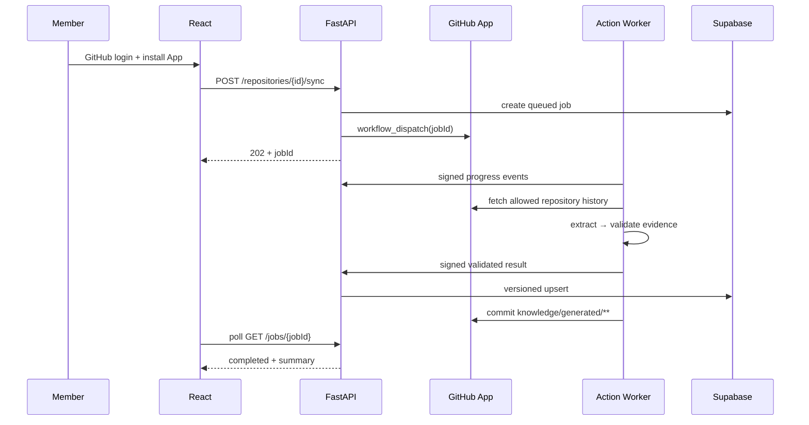

# Flow — Alignment Memory

> Authority: actors, event order, states, and failure behavior. Product scope is in [prd.md](./prd.md); tables are in [data-schema.md](./data-schema.md).

## Actors

- `Member`: authenticated repository collaborator.
- `GitHub App`: installation, repository permission, and Initial Sync dispatch.
- `FastAPI`: control plane; auth, job lifecycle, reads, Handshake/Override, validated persistence.
- `Action Analyze Job`: trusted Python worker; collection, OpenRouter call, deterministic validation.
- `Action Publish Job`: GitHub comment and allowed Markdown write; never receives the OpenRouter key.
- `Supabase`: Postgres, Auth, and row-level access control.

## Job states

`queued → fetching → analyzing → validating → persisting → writing_github → completed`

Any state may transition to `failed`; retry uses the same idempotency key. Never translate an AI/provider failure into an alignment verdict.

## 1. Connect and Initial Sync

Rules:

- Initial Sync includes existing allowed records, then saves `baselineCommitSha`.
- Poll every 2 seconds for 30 seconds, then every 5 seconds; stop on terminal state.
- Action-created Markdown must not recursively trigger analysis.

## 2. PR open or update

1. `pull_request` event starts only for an allowed collaborator and in-repository branch.
2. New head SHA cancels older analysis for the same PR.
3. Analyze Job reads trusted worker code from `main`; it never checks out or executes the PR head.
4. Create/find the idempotent Job and fetch its immutable active-knowledge context snapshot from FastAPI.
5. Collect PR title/body/diff and linked allowed sources as data.
6. Compare against the knowledge revision captured by the Job.
7. Validate structured output and exact evidence.
8. Publish Job renders a fixed template:
   - `Direct Conflict`: comment + failed job;
   - `Missing Alignment`: warning comment + successful job;
   - `Aligned`: concise success comment.
9. Do not modify official knowledge or generated Markdown.

## 3. PR merge

1. Create a serialized repository-write job.
2. Fetch changes after `baselineCommitSha` and the merged PR context.
3. Add immutable Source Versions, Knowledge Node Versions, edges, evidence, and stakeholder relations.
4. Apply Handshake/Override evidence.
5. Re-read `main` SHA before write; if moved, rebase the generated result or retry from the new base.
6. Commit only `knowledge/generated/**` with a deterministic message and content hash.
7. Advance `baselineCommitSha` only after DB persistence and GitHub write both succeed.

## 4. Issue or main Markdown event

- Automatically run only for `OWNER`, `MEMBER`, or `COLLABORATOR` actors.
- External content requires maintainer approval; it must not consume secrets automatically.
- Issue and main Markdown events update memory but do not fail unrelated work.
- Ignore bot-only generated paths.

## 5. Context Passport and Handshake

1. Load the same Alignment evidence for every stakeholder.
2. Localize explanation using preferred language, timezone, role, ownership, and recorded positions.
3. Preserve original snippets behind each citation; show side-by-side only when ambiguity is detected.
4. Stakeholder records `agree`, `needs_clarification`, or `disagree` with optional text.
5. Store response as evidence and rerun only the affected alignment.

## 6. Human Override

| Choice | Effect |
|---|---|
| `false_positive` | Preserve project Decision; mark AI finding incorrect |
| `supersede_decision` | Create new Decision version and supersede the old one |
| `insufficient_evidence` | Reclassify as Missing Alignment |

Reason and actor are required. Override appends a new record; it cannot delete sources or prior findings.

## Idempotency and concurrency

- Source: unique `(repositoryId, sourceType, externalId)`.
- Source version: unique `(sourceId, contentHash)`.
- Event: unique GitHub delivery ID or deterministic event key.
- PR analysis: unique `(repositoryId, prNumber, headSha, promptVersion)`.
- One publish result per analysis; one generated artifact per `(path, contentHash)`.
- Cancel stale PR analysis; queue repository writes; verify current SHA immediately before commit.

## Failure behavior

- `401/403`: stop; show reconnection or permission action.
- Rate limit/provider outage: honor retry timing, retry at most twice, then `analysis_failed`.
- Invalid schema/evidence: one repair attempt, then `validation_failed`; do not publish a verdict.
- GitHub SHA conflict: refetch and retry serialized write; never force-push.
- Partial DB/GitHub write: retain failed job and replay idempotently from the last completed state.
